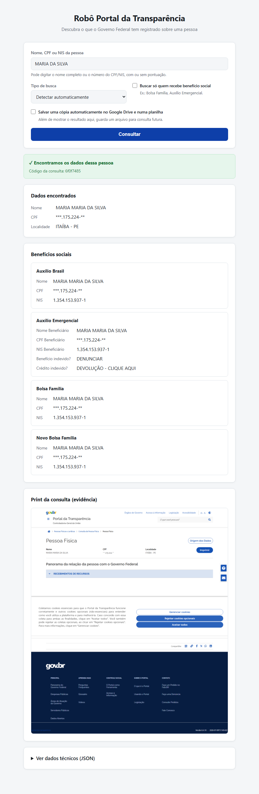
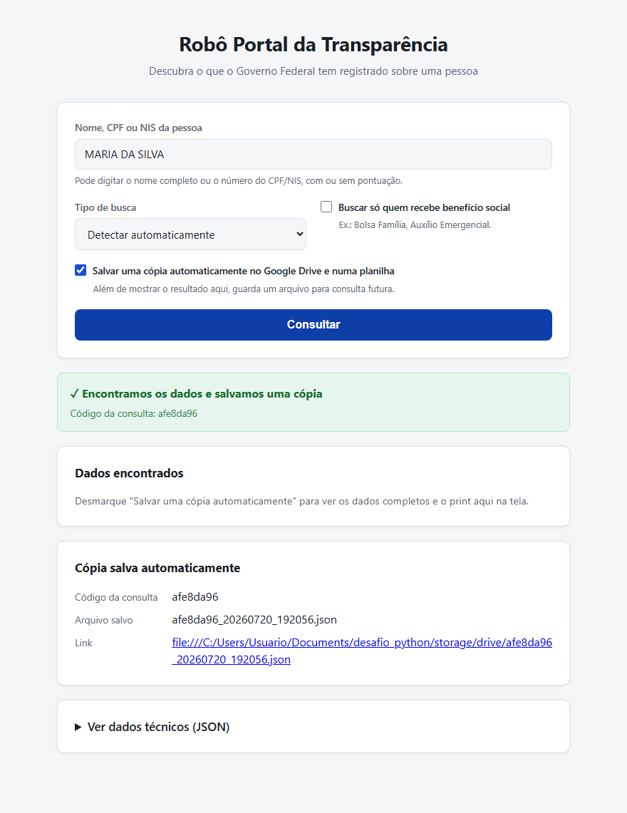
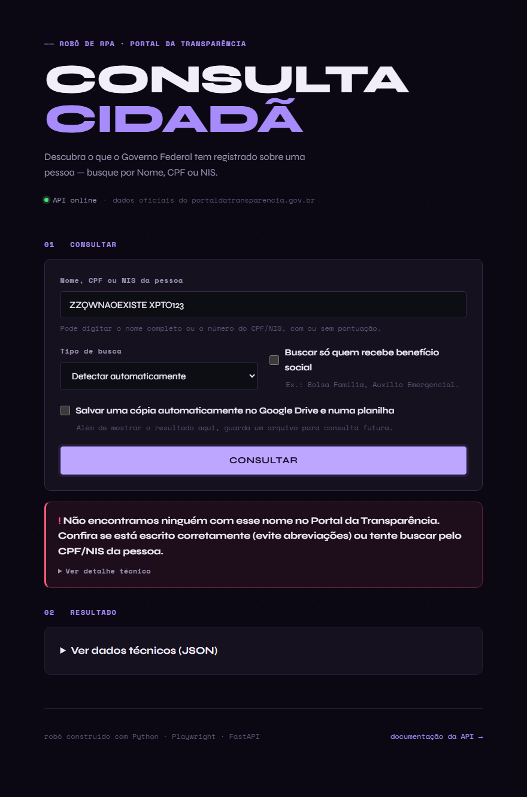
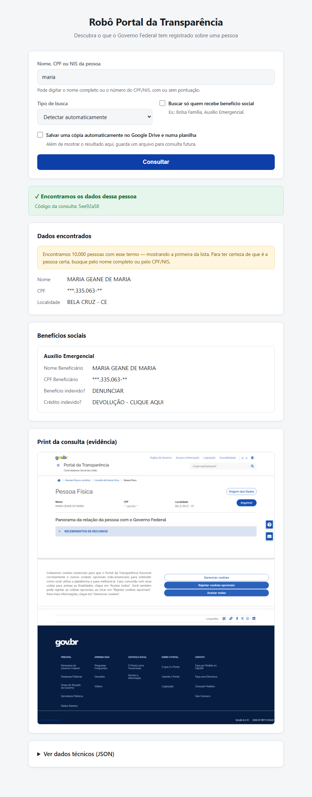

# Robô Portal da Transparência — Consulta de Pessoa Física

Robô de RPA que consulta o [Portal da Transparência](https://portaldatransparencia.gov.br)
por Nome, CPF ou NIS, coleta o panorama da pessoa e os benefícios sociais
associados, e devolve tudo em JSON (com evidência em screenshot Base64).
Exposto como API HTTP (FastAPI) com documentação Swagger/OpenAPI e uma
interface web simples para uso sem depender de `curl`/Swagger.

> Desenvolvido para o desafio técnico Full Stack Developer (Python) —
> RPA e Hiperautomação. Cobre a **Parte 1** (obrigatória) e a **Parte 2**
> (bônus) por completo.

## Sumário

- [Como executar](#como-executar)
- [Interface web](#interface-web)
- [Usando a API](#usando-a-api)
- [Decisões técnicas](#decisões-técnicas)
- [Desafios enfrentados](#desafios-enfrentados)
- [Estrutura do projeto](#estrutura-do-projeto)
- [Testes](#testes)
- [Parte 2 — Hiperautomação (Google Drive + Sheets)](#parte-2--hiperautomação-google-drive--sheets)

## Como executar

### Opção A — Docker (recomendado)

```bash
docker compose up --build
```

A API sobe em `http://localhost:8000`. Interface web em `http://localhost:8000/`.
Swagger UI em `http://localhost:8000/docs`.

### Opção B — Local (Python 3.11+)

```bash
python -m venv .venv
# Windows:
.venv\Scripts\activate
# Linux/Mac:
source .venv/bin/activate

pip install -r requirements.txt
playwright install chromium

uvicorn app.main:app --reload
```

## Interface web

Acesse `http://localhost:8000/` (ou a porta configurada) para usar o robô
sem precisar de `curl` ou do Swagger: um formulário com Nome/CPF/NIS, o tipo
de busca, o filtro "Beneficiário de Programa Social" e uma opção para já
salvar automaticamente no Google Drive/Sheets.


O resultado é renderizado na própria página: dados cadastrais, cada
benefício encontrado com seus detalhes, a evidência (screenshot) e o JSON
completo num painel colapsável.



Quando a opção "Salvar uma cópia automaticamente" está marcada, a tela mostra
o código da consulta, o nome do arquivo e o link gerado no Drive em vez dos
dados completos:



Erros aparecem em linguagem simples, com a mensagem técnica exata dos
cenários de teste disponível num "Ver detalhe técnico" colapsável:



Nomes genéricos (ex.: só "Maria") podem casar com milhares de pessoas no
portal — o robô sempre segue o primeiro resultado (conforme o cenário de
sucesso por nome do desafio), mas a tela avisa quando isso acontece, para não
passar a falsa impressão de que aquela é a única pessoa com aquele nome:



É um front-end estático (`app/static/`, HTML/CSS/JS sem build step),
servido pela própria API via `StaticFiles` — não há servidor nem processo
adicional para rodar.

## Usando a API

**POST /consulta**

```json
{
  "termo": "MARIA DA SILVA",
  "tipo": "auto",
  "filtro_programa_social": false
}
```

- `termo`: nome completo, CPF ou NIS.
- `tipo`: `auto` (padrão, detecta CPF/NIS por dígitos vs. nome), `cpf`, `nis` ou `nome`.
- `filtro_programa_social`: aplica o filtro "Beneficiário de Programa Social" na busca.

Resposta (sempre HTTP 200; o campo `status` diferencia sucesso/erro):

```json
{
  "status": "sucesso",
  "identificador_unico": "a1b2c3d4",
  "termo_consultado": "MARIA DA SILVA",
  "tipo_busca": "nome",
  "data_hora": "2026-07-20T14:41:34.200073",
  "dados": {
    "nome": "MARIA MARIA DA SILVA",
    "cpf": "***.175.224-**",
    "nis": null,
    "localidade": "ITAÍBA - PE",
    "secoes": { "RECEBIMENTOS DE RECURSOS": "..." },
    "beneficios": [
      { "tipo": "Bolsa Família", "detalhes": { "NIS": "1.354.153.937-1", "...": "..." } }
    ],
    "total_resultados_encontrados": 11
  },
  "evidencia_base64": "iVBORw0KGgoAAAANSUhEUg...",
  "mensagem_erro": null,
  "explicacao": null
}
```

Em caso de erro (`status: "erro"`), `dados` e `evidencia_base64` vêm `null`.
Dois campos descrevem o erro, para públicos diferentes:
- `mensagem_erro`: o texto **exato** exigido pelos cenários de teste do
  desafio (ex.: *"Não foi possível retornar os dados no tempo de resposta
  solicitado"* ou *"Foram encontrados 0 resultados para o termo ..."*) —
  não deve ser alterado, é o que valida a Parte 1.
- `explicacao`: a mesma informação em linguagem simples, pensada para
  exibição a um usuário leigo (é o que a interface web mostra em destaque;
  `mensagem_erro` fica disponível num "Ver detalhe técnico" colapsável).

`dados.total_resultados_encontrados` informa quantas pessoas a busca
encontrou no total — buscas por nomes comuns (ex.: "Maria") podem retornar
milhares. O robô sempre coleta o **primeiro** resultado da lista (conforme o
cenário de sucesso por nome do desafio); esse campo existe para deixar essa
ambiguidade explícita, em vez de escondê-la.

Exemplo via `curl`:

```bash
curl -X POST http://localhost:8000/consulta \
  -H "Content-Type: application/json" \
  -d '{"termo": "MARIA DA SILVA"}'
```

## Decisões técnicas

**Playwright (async) + FastAPI.** A dupla é a combinação natural para o
requisito de *execuções simultâneas*: FastAPI roda em event loop assíncrono e
o `async_api` do Playwright se integra diretamente, sem precisar de threads
ou processos extras para paralelizar.

**Um browser, múltiplos contexts.** Em vez de abrir um `Browser` Chromium por
requisição (caro em memória/CPU), o processo mantém **um único browser** vivo
(`app/browser.py`) e cria um `BrowserContext` isolado por consulta — contexts
são baratos, têm cookies/estado próprios, e por isso são seguros para rodar em
paralelo. Um `asyncio.Semaphore` limita quantas consultas rodam de fato ao
mesmo tempo (`MAX_CONCURRENT_SCRAPES`, padrão 4), protegendo o container de
esgotar memória sob carga.

**Filtro social via query string, não via clique no checkbox.** O portal
aceita `?termo=X&beneficiarioProgramaSocial=true` diretamente na URL de busca.
Isso evita depender de um clique em um checkbox que, na prática, ficava fora
da viewport em alguns layouts — a URL é 100% determinística.

**Seletores centralizados com fallback (`app/config.py`).** O Portal da
Transparência é uma SPA gov.br cujo layout pode mudar. Cada seletor crítico é
uma lista, tentada em ordem — se o principal quebrar, o robô ainda tenta as
alternativas antes de falhar. Isso concentra a manutenção em um único arquivo.

**Erros de negócio como exceções tipadas, nunca HTTP 500.** `TempoRespostaError`
e `SemResultadosError` (`app/exceptions.py`) já carregam a mensagem exata
exigida pelos cenários de teste. A função `consultar()` nunca deixa uma
exceção escapar: tudo vira um `ConsultaResponse` com `status="erro"`, e a API
sempre responde HTTP 200 — o único código de erro HTTP é 422, reservado para
entrada inválida (ex.: `termo` vazio).

**Identificador único desde já.** Cada consulta recebe um `identificador_unico`
(hex curto) no momento em que é feita — usado na Parte 2 como nome do arquivo
salvo no Drive e como chave da linha na planilha.

**Parte 2 em Python, não em ferramenta no-code.** O desafio sugere
Make/Activepieces/Zapier, mas como "ferramentas sugeridas" (não obrigatórias).
Optei por implementar o mesmo fluxo em Python (`app/hiperautomacao.py`) pelos
mesmos motivos que guiaram a Parte 1: é testável automaticamente, versionável,
e reaproveita toda a infraestrutura (config, testes, Docker) já construída —
sem depender de uma conta externa nem de uma UI que eu não conseguiria
demonstrar de forma reproduzível neste ambiente. O endpoint faz exatamente os
mesmos 3 passos que um cenário Make faria: chama a API do robô por HTTP, sobe
o arquivo no Drive, grava a linha na planilha. Ver a seção
[Parte 2](#parte-2--hiperautomação-google-drive--sheets) para detalhes.

## Desafios enfrentados

**Bloqueio por AWS WAF Captcha em modo headless.** A primeira tentativa em
`headless=True` caía na tela "Vamos confirmar que você é humano" do AWS WAF —
o Chromium headless "puro" é fingerprinted e bloqueado antes mesmo de chegar
à busca. A solução foi neutralizar os sinais mais comuns de automação via
`context.add_init_script` (zera `navigator.webdriver`, simula
`navigator.plugins`/`navigator.languages` e `window.chrome`) combinado com a
flag `--disable-blink-features=AutomationControlled` no launch do Chromium.
Validado empiricamente: com esse ajuste o portal responde normalmente em
headless, sem precisar de serviço de resolução de captcha.

**Banner de cookies (LGPD) interceptando cliques.** O portal renderiza um
`#cookiebar` fixo que, se ignorado, intercepta o clique no primeiro resultado
da busca (o Playwright reporta "elemento fora da viewport"/click
interceptado). Resolvido dispensando o banner ("Aceitar todos") logo após
cada navegação, antes de qualquer interação.

**Estrutura do panorama é um accordion carregado sob demanda.** A seção
"Panorama da relação com o Governo Federal" (e dentro dela,
"RECEBIMENTOS DE RECURSOS") só renderiza o conteúdo — inclusive os links
"Detalhar" de cada benefício — depois que o cabeçalho do accordion é clicado.
O robô expande todas as seções do accordion antes de coletar dados e tirar o
screenshot, garantindo que a evidência capture a tela já com as informações
visíveis.

**Descoberta de seletores sem DevTools.** Como o ambiente de desenvolvimento
não tinha um browser interativo disponível, os seletores reais foram
levantados escrevendo pequenos scripts de inspeção Playwright (headless,
descartados após o uso) que faziam dump de botões, headings e contadores de
resultado da página real — e comparando com screenshots tirados pelo próprio
Playwright. Esse processo confirmou, por exemplo, que a mensagem de "sem
resultados" é sinalizada por `#countResultados` valendo `"0"`, e não por um
texto fixo na tela.

## Estrutura do projeto

```
app/
├── main.py                    # FastAPI: rotas da Parte 1 e 2, Swagger automático
├── scraper.py                  # Parte 1: navegação e coleta (Playwright)
├── browser.py                    # Ciclo de vida do browser compartilhado + contexts
├── hiperautomacao.py               # Parte 2: orquestra robô -> Drive -> Sheets
├── integrations/
│   ├── base.py                       # Contratos (Protocol) de Drive/Sheets
│   ├── local_client.py                 # Stand-in local (demo/testes, sem credenciais)
│   ├── google_client.py                  # Integração real (service account)
│   └── factory.py                          # Escolhe local vs. google por env var
├── static/
│   ├── index.html                       # Interface web (formulário + resultado)
│   ├── styles.css                         # Estilos (suporta tema claro/escuro)
│   └── app.js                               # Lógica de fetch e renderização
├── models.py                  # Contratos Pydantic de entrada/saída
├── config.py                    # Settings (env vars) + seletores do portal
├── exceptions.py                  # Erros de negócio com as mensagens dos cenários
└── utils.py                         # Funções puras (detecção de tipo, normalização)
tests/
├── test_utils.py             # Testes unitários das funções puras e mensagens
├── test_api.py                 # Testes de contrato da API (robô mockado)
└── test_hiperautomacao.py        # Testes da Parte 2 (modo local, isolado em tmp_path)
scripts/
├── smoke.py                  # Consulta manual contra o portal real
└── smoke_concorrente.py       # Valida execução simultânea real
```

## Testes

```bash
pytest
```

Os testes de `tests/` **não tocam a rede** — o robô é substituído por um
fake no nível da API/orquestração, cobrindo o contrato JSON dos cenários de
sucesso/erro por CPF e Nome (Parte 1) e o fluxo de Drive/Sheets em modo local
isolado em diretório temporário (Parte 2). Para validar contra o portal real
(rede necessária):

```bash
# uma consulta manual
PYTHONPATH=. python scripts/smoke.py "MARIA DA SILVA"

# valida execução simultânea de verdade
PYTHONPATH=. python scripts/smoke_concorrente.py
```

## Parte 2 — Hiperautomação (Google Drive + Sheets)

**POST /hiperautomacao/processar** executa o fluxo completo:

1. Chama `POST /consulta` (Parte 1) **por HTTP** — o mesmo endpoint que um
   workflow externo chamaria.
2. Em caso de sucesso, salva o JSON no Google Drive com o nome
   `[IDENTIFICADOR_UNICO]_[DATA_HORA].json`.
3. Registra uma linha no Google Sheets: identificador único, nome, CPF,
   data/hora e link direto do arquivo no Drive.

Em caso de erro na consulta, a mensagem é apenas propagada — nada é gravado
no Drive/Sheets (não há dado útil para armazenar).

```bash
curl -X POST http://localhost:8000/hiperautomacao/processar \
  -H "Content-Type: application/json" \
  -d '{"termo": "MARIA DA SILVA"}'
```

```json
{
  "status": "sucesso",
  "identificador_unico": "4fa26d7a",
  "nome_arquivo_drive": "4fa26d7a_20260720_145914.json",
  "link_drive": "https://drive.google.com/file/d/.../view",
  "mensagem_erro": null
}
```

### Dois modos, mesmo código (`GOOGLE_INTEGRATION_MODE`)

| Modo | Quando usar | O que faz |
|---|---|---|
| `local` (padrão) | Demonstração e testes, sem credenciais | Grava o JSON em `storage/drive/*.json` e acrescenta uma linha em `storage/sheet.csv` |
| `google` | Produção / apresentação com Drive e Sheets reais | Sobe o arquivo via Google Drive API e grava a linha via Google Sheets API, usando uma service account |

A troca é só uma variável de ambiente — `app/hiperautomacao.py` não sabe (nem
precisa saber) qual das duas está ativa; ele depende apenas dos contratos em
`app/integrations/base.py` (ver `app/integrations/factory.py`).

### Demonstração (modo local, já rodada nesta entrega)

```bash
uvicorn app.main:app --reload  # ou docker compose up

curl -X POST http://localhost:8000/hiperautomacao/processar \
  -H "Content-Type: application/json" \
  -d '{"termo": "MARIA DA SILVA"}'
```

Resultado real de uma execução contra o portal:

```csv
# storage/sheet.csv
identificador_unico,nome,cpf,data_hora,link_drive
4fa26d7a,MARIA MARIA DA SILVA,***.175.224-**,2026-07-20T14:59:14.102099,file:///.../storage/drive/4fa26d7a_20260720_145914.json
```

```json
// storage/drive/4fa26d7a_20260720_145914.json (arquivo completo salvo)
{
  "status": "sucesso",
  "identificador_unico": "4fa26d7a",
  "dados": {
    "nome": "MARIA MARIA DA SILVA",
    "cpf": "***.175.224-**",
    "beneficios": [
      { "tipo": "Auxílio Brasil", "detalhes": { "NIS": "1.354.153.937-1", "...": "..." } },
      { "tipo": "Auxílio Emergencial", "detalhes": { "...": "..." } },
      { "tipo": "Bolsa Família", "detalhes": { "...": "..." } },
      { "tipo": "Novo Bolsa Família", "detalhes": { "...": "..." } }
    ]
  },
  "evidencia_base64": "iVBORw0KGgo... (192KB)"
}
```

E o cenário de erro não grava nada (testado): uma busca por nome inexistente
devolve `status: "erro"` com a mensagem do cenário de teste, sem criar arquivo
no Drive nem linha na planilha.

> Os arquivos gerados pelo modo local contêm dados pessoais reais coletados
> do Portal da Transparência (CPF, nome, benefícios). Por isso `storage/` está
> no `.gitignore` e não é versionado — é só um artefato de demonstração local.

### Ativando o modo `google` (Drive e Sheets reais)

1. **Criar um projeto no Google Cloud** e habilitar as APIs *Google Drive
   API* e *Google Sheets API*.
2. **Criar uma service account** (IAM & Admin → Service Accounts), gerar uma
   chave JSON e salvá-la localmente (fora do repositório).
3. **Compartilhar** a pasta do Drive e a planilha do Sheets com o e-mail da
   service account (campo `client_email` no JSON) — dando permissão de
   Editor. **Não torne nada público**: os dados incluem CPF e evidências
   pessoais (boa prática de segurança / LGPD).
4. Configurar as variáveis de ambiente (`.env` ou `docker-compose.yml`):

   ```bash
   GOOGLE_INTEGRATION_MODE=google
   GOOGLE_CREDENTIALS_PATH=/caminho/para/service-account.json
   GOOGLE_DRIVE_FOLDER_ID=<id da pasta do Drive>
   GOOGLE_SHEETS_ID=<id da planilha>
   ```

5. Reiniciar a API. Nenhuma linha de código muda — `factory.py` já resolve
   para `GoogleDriveClient`/`GoogleSheetsClient`.

O acesso usa OAuth 2.0 servidor-a-servidor (service account) com escopos
mínimos (`drive.file`, não o Drive inteiro da conta), conforme as boas
práticas de segurança pedidas no desafio — nenhuma credencial fica em código,
só em variável de ambiente / arquivo fora do controle de versão.

### Por que não Make/Activepieces/Zapier

O desafio lista essas ferramentas como sugestão de free tier, não como
requisito. Como não tenho acesso a um navegador interativo neste ambiente
para montar e testar um cenário nessas plataformas de forma verificável,
optei pela alternativa que eu conseguia implementar, testar automaticamente e
demonstrar de ponta a ponta com o portal real: o próprio Python. O endpoint
`/hiperautomacao/processar` cumpre exatamente o mesmo contrato que um cenário
Make cumpriria (webhook → Drive → Sheets) e pode inclusive ser chamado *a
partir* de um Make/Zapier/Activepieces como o passo HTTP do fluxo, se no
futuro for necessário orquestrar por lá.
